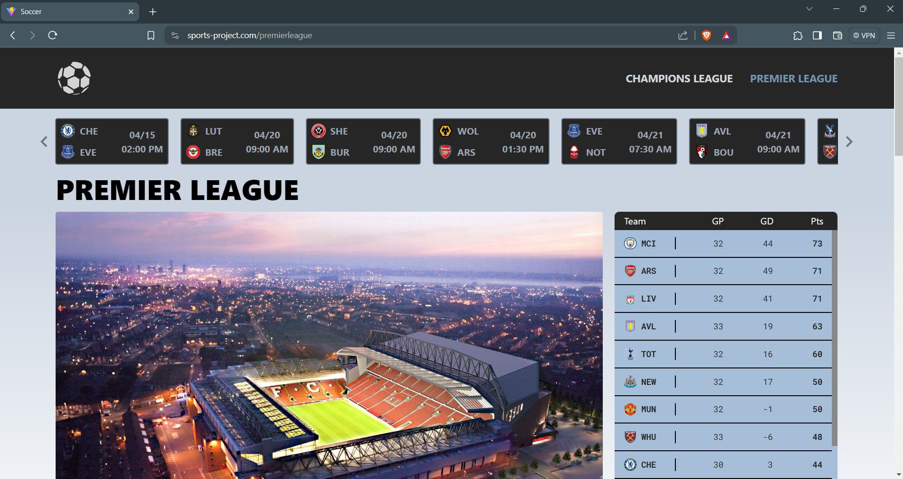

<h1 align="center">
  Soccer Project
  <h4 align="center">The ultimate website to follow and track Champions League and Premier League matches</h4>

 <!-- <a href="#demo-video">Demo</a> • -->
  <a href="#key-features">Key Features</a>

</img>

## Key Features

- <b>Azure Serverless Backend</b>
  - Leveraged Azure Functions to design and deploy a serverless backend system, enabling real-time retrieval of the
    latest soccer matches and statistics, enhancing the overall efficiency and scalability of the application
      
- <b>React TypeScript Frontend</b>
  - Developed and launched a React website featuring real-time updates on upcoming matches, latest news, and live
    league tables, enhancing user engagement and experience
      
- <b>Data Analysis</b>

  - Utilized Pandas to analyze a comprehensive European Soccer dataset, extracting valuable insights and trends, visualized the findings use Recharts, a data visualization library
      

- <b>CI/CD</b>

  - Implemented a CI/CD pipeline using Github Actions, automating and streamlining workflows for efficient code
    integration, and deployment
      

- <b>Tech Stack</b>
  - <b>Programming Languages:</b> TypeScript, JavaScript, Python and SQL
  - <b>Libraries:</b> React, Azure Functions and Pandas
  - <b>Cloud Technologies:</b> Microsoft Azure and Github
      

 
