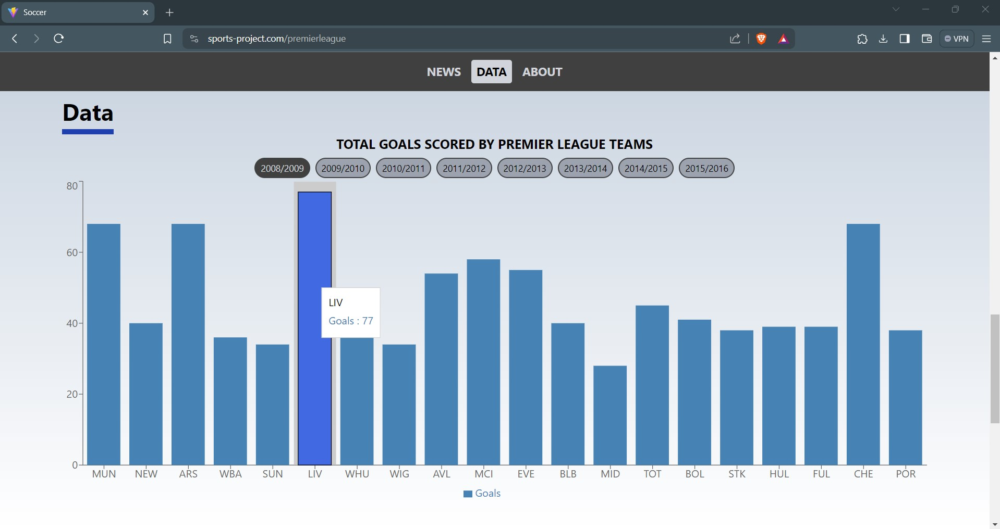

<h1 align="center">
  Soccer Project
  <h4 align="center">The ultimate website to follow and track Champions League and Premier League matches</h4>
  <p align="center">Visit Website <a href="https://www.sports-project.com">here<a></p>

<p align="center">
  <a href="#key-features">Key Features</a> •
  <a href="#data-analysis">Data Analysis</a> 
</p>

</img>

## Key Features

- <b>Azure Serverless Backend</b>
  - Leveraged Azure Functions to design and deploy a serverless backend system, enabling real-time retrieval of the
    latest soccer matches and statistics, enhancing the overall efficiency and scalability of the application
    <br></br>
- <b>React TypeScript Frontend</b>

  - Developed and launched a React website featuring real-time updates on upcoming matches, latest news, and live
    league tables, enhancing user engagement and experience
    <br></br>

- <b>CI/CD</b>

  - Implemented a CI/CD pipeline using Github Actions, automating and streamlining workflows for efficient code
    integration, and deployment
    <br></br>

- <b>Tech Stack</b>
  - <b>Programming Languages:</b> TypeScript, JavaScript, Python and SQL
  - <b>Libraries:</b> React, Azure Functions and Pandas
  - <b>Cloud Technologies:</b> Microsoft Azure and Github
    <br></br>
    <br>

## Data Analysis

I utilized Pandas to analyze a comprehensive <a href="https://www.kaggle.com/datasets/hugomathien/soccer">European Soccer Dataset</a>, extracting valuable insights and trends. I visualized the findings using Recharts, a data visualization library.

</img>

Below is the code I used to extract meaningful data from the dataset.

```python
import pandas as pd
```

```python
import sqlite3
```

```python
conn = sqlite3.connect("database.sqlite")
```

```python
homedf = """SELECT home_team_api_id, SUM(home_team_goal) AS home_goals FROM MATCH WHERE season = '2015/2016' AND league_id = 1729 GROUP BY home_team_api_id"""
awaydf = """SELECT away_team_api_id, SUM(away_team_goal) AS away_goals FROM MATCH WHERE season = '2015/2016' AND league_id = 1729 GROUP BY away_team_api_id"""

home = pd.read_sql_query(homedf, conn)
away = pd.read_sql_query(awaydf, conn)

print(home)
print(away)
```

        home_team_api_id  home_goals
    0               8197          35
    1               8455          32
    2               8456          47
    3               8466          39
    4               8472          23
    5               8586          35
    6               8650          33
    7               8654          34
    8               8659          20
    9               8668          35
    10              8678          23
    11              9817          20
    12              9825          31
    13              9826          19
    14              9850          26
    15             10003          20
    16             10194          22
    17             10252          14
    18             10260          27
    19             10261          32
        away_team_api_id  away_goals
    0               8197          33
    1               8455          27
    2               8456          24
    3               8466          20
    4               8472          25
    5               8586          34
    6               8650          30
    7               8654          31
    8               8659          14
    9               8668          24
    10              8678          22
    11              9817          20
    12              9825          34
    13              9826          20
    14              9850          13
    15             10003          22
    16             10194          19
    17             10252          13
    18             10260          22
    19             10261          12

```python
union = f"{homedf} UNION ALL {awaydf}"
uniondf = pd.read_sql_query(union, conn)
print(uniondf)
```

        home_team_api_id  home_goals
    0               8197          35
    1               8455          32
    2               8456          47
    3               8466          39
    4               8472          23
    5               8586          35
    6               8650          33
    7               8654          34
    8               8659          20
    9               8668          35
    10              8678          23
    11              9817          20
    12              9825          31
    13              9826          19
    14              9850          26
    15             10003          20
    16             10194          22
    17             10252          14
    18             10260          27
    19             10261          32
    20              8197          33
    21              8455          27
    22              8456          24
    23              8466          20
    24              8472          25
    25              8586          34
    26              8650          30
    27              8654          31
    28              8659          14
    29              8668          24
    30              8678          22
    31              9817          20
    32              9825          34
    33              9826          20
    34              9850          13
    35             10003          22
    36             10194          19
    37             10252          13
    38             10260          22
    39             10261          12

```python
total = f"WITH total_goals AS ( {union} ) SELECT home_team_api_id as team_id, SUM(home_goals) as total_goals FROM total_goals GROUP BY home_team_api_id"
totaldf = pd.read_sql_query(total, conn)
print(totaldf)
```

        team_id  total_goals
    0      8197           68
    1      8455           59
    2      8456           71
    3      8466           59
    4      8472           48
    5      8586           69
    6      8650           63
    7      8654           65
    8      8659           34
    9      8668           59
    10     8678           45
    11     9817           40
    12     9825           65
    13     9826           39
    14     9850           39
    15    10003           42
    16    10194           41
    17    10252           27
    18    10260           49
    19    10261           44

```python
team = "SELECT team_api_id AS team_id, team_long_name, team_short_name FROM TEAM"
teamdf = pd.read_sql_query(team, conn)
print(teamdf)
```

         team_id      team_long_name team_short_name
    0       9987            KRC Genk             GEN
    1       9993        Beerschot AC             BAC
    2      10000    SV Zulte-Waregem             ZUL
    3       9994    Sporting Lokeren             LOK
    4       9984   KSV Cercle Brugge             CEB
    ..       ...                 ...             ...
    294    10190       FC St. Gallen             GAL
    295    10191             FC Thun             THU
    296     9777         Servette FC             SER
    297     7730  FC Lausanne-Sports             LAU
    298     7896              Lugano             LUG

    [299 rows x 3 columns]

```python
merge = pd.merge(teamdf, totaldf, on="team_id")
print(merge)
```

        team_id        team_long_name team_short_name  total_goals
    0     10260     Manchester United             MUN           49
    1     10261      Newcastle United             NEW           44
    2      9825               Arsenal             ARS           65
    3      8659  West Bromwich Albion             WBA           34
    4      8472            Sunderland             SUN           48
    5      8650             Liverpool             LIV           63
    6      8654       West Ham United             WHU           65
    7     10252           Aston Villa             AVL           27
    8      8456       Manchester City             MCI           71
    9      8668               Everton             EVE           59
    10     8586     Tottenham Hotspur             TOT           69
    11    10194            Stoke City             STK           41
    12     8455               Chelsea             CHE           59
    13    10003          Swansea City             SWA           42
    14     9850          Norwich City             NOR           39
    15     8466           Southampton             SOU           59
    16     9826        Crystal Palace             CRY           39
    17     8197        Leicester City             LEI           68
    18     8678           Bournemouth             BOU           45
    19     9817               Watford             WAT           40

```python
json = merge.to_json(orient="records", lines=True)
print(json)
```

    {"team_id":10260,"team_long_name":"Manchester United","team_short_name":"MUN","total_goals":49}
    {"team_id":10261,"team_long_name":"Newcastle United","team_short_name":"NEW","total_goals":44}
    {"team_id":9825,"team_long_name":"Arsenal","team_short_name":"ARS","total_goals":65}
    {"team_id":8659,"team_long_name":"West Bromwich Albion","team_short_name":"WBA","total_goals":34}
    {"team_id":8472,"team_long_name":"Sunderland","team_short_name":"SUN","total_goals":48}
    {"team_id":8650,"team_long_name":"Liverpool","team_short_name":"LIV","total_goals":63}
    {"team_id":8654,"team_long_name":"West Ham United","team_short_name":"WHU","total_goals":65}
    {"team_id":10252,"team_long_name":"Aston Villa","team_short_name":"AVL","total_goals":27}
    {"team_id":8456,"team_long_name":"Manchester City","team_short_name":"MCI","total_goals":71}
    {"team_id":8668,"team_long_name":"Everton","team_short_name":"EVE","total_goals":59}
    {"team_id":8586,"team_long_name":"Tottenham Hotspur","team_short_name":"TOT","total_goals":69}
    {"team_id":10194,"team_long_name":"Stoke City","team_short_name":"STK","total_goals":41}
    {"team_id":8455,"team_long_name":"Chelsea","team_short_name":"CHE","total_goals":59}
    {"team_id":10003,"team_long_name":"Swansea City","team_short_name":"SWA","total_goals":42}
    {"team_id":9850,"team_long_name":"Norwich City","team_short_name":"NOR","total_goals":39}
    {"team_id":8466,"team_long_name":"Southampton","team_short_name":"SOU","total_goals":59}
    {"team_id":9826,"team_long_name":"Crystal Palace","team_short_name":"CRY","total_goals":39}
    {"team_id":8197,"team_long_name":"Leicester City","team_short_name":"LEI","total_goals":68}
    {"team_id":8678,"team_long_name":"Bournemouth","team_short_name":"BOU","total_goals":45}
    {"team_id":9817,"team_long_name":"Watford","team_short_name":"WAT","total_goals":40}
